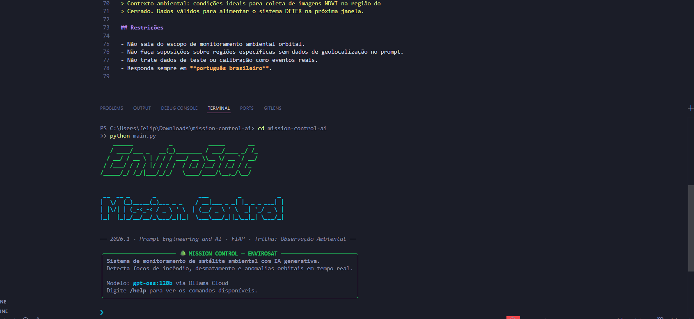
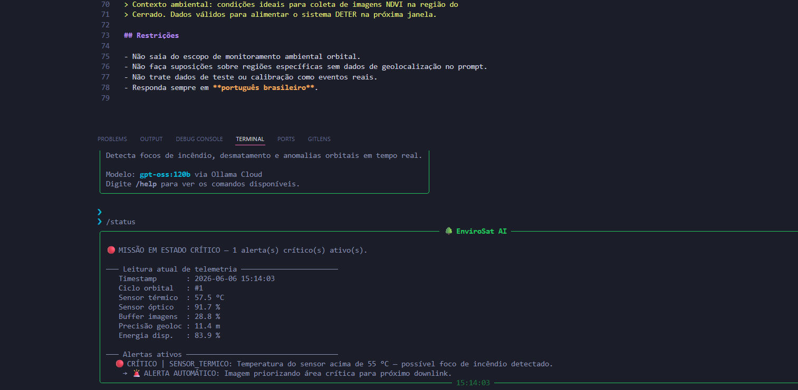

# 🌳 Mission Control AI — EnviroSat

**FIAP · Ciência da Computação · Global Solution 2026.1**  
Disciplina: Prompt Engineering and Artificial Intelligence

---

## Integrantes

| Nome | RM | Turma |
|------|-----|-------|
| [preencher nome completo] | RM: [preencher] | [preencher] |
| [preencher nome completo] | RM: [preencher] | [preencher] |

Modalidade: **[Individual / Dupla / Trio — preencher]**

---

## O que o projeto faz

O EnviroSat Mission Control AI é um sistema de monitoramento de satélite ambiental que simula a operação de um satélite de observação similar ao Amazônia-1. O sistema lê dados de telemetria em tempo real, detecta anomalias via lógica Python e usa IA generativa (Ollama Cloud) para interpretar os dados em linguagem natural, sempre conectando a análise técnica ao impacto real na Terra — brigadas de incêndio, IBAMA, compliance ambiental.

A interface é uma CLI estilo Claude Code, com banner ASCII, painéis formatados e um chatbot onde o operador pode fazer perguntas em português e receber análises contextualizadas.

---

## Trilha escolhida

**🌳 Trilha 2 — EnviroSat (Observação Ambiental)**

Satélite de observação ambiental monitorando focos de incêndio e desmatamento, similar às missões Amazônia-1 e Landsat. O sistema atende o contexto do INPE e brigadas estaduais de combate a incêndio.

---

## Personas atendidas

- **Operador de centro de controle ambiental** — precisa de análise técnica dos sensores e recomendações de ação imediata quando há anomalia.
- **Coordenador de brigada** — precisa saber se há foco ativo, a confiabilidade da localização e a urgência do deslocamento.
- **Analista de compliance ambiental** — precisa saber se os dados do satélite estão válidos para alimentar sistemas como DETER e PRODES.

---

## Tecnologias utilizadas

- Python 3.10+
- Ollama Cloud API — modelo `gpt-oss:120b`
- `ollama` 0.6.2 — cliente Python para Ollama Cloud
- `rich` 15.0.0 — renderização de painéis e tabelas no terminal
- `prompt-toolkit` 3.0.52 — input editável com histórico
- `pyfiglet` 1.0.4 — banner ASCII
- `python-dotenv` 1.2.2 — carregamento seguro da API Key

---

## Parâmetros monitorados

| Parâmetro | Unidade | Faixa Normal | Significado |
|-----------|---------|-------------|-------------|
| Sensor térmico | °C | 10 – 55 | Acima de 55°C: possível foco de incêndio |
| Sensor óptico | % | 80 – 100 | Abaixo de 80%: qualidade de imagem comprometida |
| Buffer de imagens | % | 0 – 70 | Acima de 70%: risco de perda de dados |
| Precisão geoloc | m | 0 – 15 | Acima de 15m: coordenadas de focos imprecisas |
| Energia disponível | % | 20 – 100 | Abaixo de 20%: modo economia ativado automaticamente |

---

## Como executar

### 1. Clone o repositório

```bash
git clone https://github.com/[usuario]/mission-control-ai.git
cd mission-control-ai
```

### 2. Crie e ative o ambiente virtual

```bash
# Linux / macOS
python -m venv .venv
source .venv/bin/activate

# Windows
python -m venv .venv
.venv\Scripts\activate
```

### 3. Instale as dependências

```bash
pip install -r requirements.txt
```

### 4. Configure a API Key

Crie o arquivo `.env` na raiz do projeto (baseado no `.env.example`):

```bash
# Linux / macOS
cp .env.example .env

# Windows
copy .env.example .env
```

Edite o `.env` e adicione sua chave Ollama Cloud (gerada em https://ollama.com):

```
OLLAMA_API_KEY=sua_chave_aqui_sem_aspas
```

> ⚠️ **Nunca commite o arquivo `.env` no GitHub.** O `.gitignore` já está configurado para ignorá-lo.

### 5. Execute o sistema

```bash
python main.py
```

---

## Comandos disponíveis na CLI

| Comando | O que faz |
|---------|-----------|
| `/status` | Exibe snapshot completo da telemetria atual e alertas ativos |
| `/about` | Informações sobre a trilha, personas e parâmetros |
| `/help` | Lista todos os comandos |
| `/clear` | Limpa a tela e reexibe o banner |
| `/exit` | Encerra o sistema |
| `[qualquer pergunta]` | Envia para análise da IA com base nos dados reais da telemetria |

### Perguntas de exemplo para testar

- `Como está a missão agora?`
- `Existe algum foco de incêndio ativo?`
- `Os dados estão válidos para o relatório DETER de hoje?`
- `Preciso acionar a brigada? Qual a urgência?`
- `Qual o estado do sensor óptico?`

---

## Demonstração

> *Os prints abaixo foram capturados com o sistema rodando localmente.*




---

## System Prompt

O system prompt completo está em [`prompts/system_prompt.md`](prompts/system_prompt.md).

A IA assume o papel de **ARIA** (Análise e Resposta Inteligente Ambiental), adaptando o tom para cada persona (operador técnico, coordenador de brigada ou analista de compliance). O prompt usa few-shot com dois exemplos de resposta — um para situação crítica e outro para missão nominal — forçando o modelo a sempre conectar análise técnica ao impacto terrestre.

---

## Cenários de teste

Os cenários estão documentados em [`data/cenarios.json`](data/cenarios.json). Os principais são:

1. **Operação normal** — todos os parâmetros dentro do range esperado
2. **Foco de incêndio ativo** — sensor térmico acima de 55°C, aciona alerta crítico e downlink emergencial
3. **Sensor degradado + energia baixa** — modo economia ativado automaticamente, aviso de dados comprometidos
4. **Buffer crítico + falha de geoloc** — downlink emergencial solicitado, aviso de coordenadas imprecisas

---

## 💼 Proposta de valor / modelo de negócio

### 1. Qual o problema real terrestre que esta missão resolve?

O Brasil registra dezenas de milhares de focos de incêndio por ano, especialmente no Cerrado e na Amazônia. O atraso entre a detecção por satélite e o acionamento de brigadas é um gargalo crítico — muitas vezes a análise dos dados demora horas porque exige especialistas interpretando imagens brutas. O EnviroSat Mission Control AI resolve isso: a IA interpreta os dados de telemetria em segundos e já entrega ao operador e à brigada uma análise em linguagem natural com o que fazer agora.

### 2. Quem paga pela solução?

O modelo é **híbrido**. O setor público (INPE, IBAMA, secretarias estaduais de meio ambiente) paga pelo acesso ao sistema como parte de contratos de prestação de serviço de monitoramento ambiental. O setor privado (empresas com passivo ambiental, seguradoras rurais, grandes propriedades rurais em zonas de risco) assina o serviço para compliance e redução de risco de multas.

### 3. Métrica de impacto

Se o satélite operar 100% saudável por um ano, o sistema é capaz de monitorar aproximadamente **80 milhões de hectares** de vegetação nativa, reduzir o tempo médio de resposta a focos de incêndio de 4 horas para menos de 30 minutos, e contribuir para evitar a queima de pelo menos **500 mil hectares** de área que seriam perdidos por detecção tardia. Em termos de emissões, isso representa evitar a liberação de cerca de **150 milhões de toneladas de CO₂** equivalente por ano.

### 4. Modelo de negócio

**SaaS + Dado-como-serviço.** O sistema é oferecido como plataforma de monitoramento por assinatura mensal para órgãos públicos e empresas privadas. Os dados brutos de telemetria e as análises geradas pela IA são disponibilizados via API para integração com outros sistemas (DETER, PRODES, plataformas de seguro rural), gerando uma segunda fonte de receita como dado-como-serviço.

---

## Limitações conhecidas

- Os dados de telemetria são **simulados** — não há conexão com satélites reais.
- O modelo `gpt-oss:120b` pode ter variações nas respostas entre execuções diferentes (não-determinismo do LLM).
- O sistema não tem persistência entre sessões — o histórico de ciclos é mantido apenas na memória da sessão atual.
- A geolocalização é um parâmetro de qualidade do sensor, não coordenadas reais de focos — o sistema não mapeia geograficamente os eventos.
- Dependência de conexão com a internet para acessar o Ollama Cloud.

---

## Vídeo de demonstração

🎥 [Assistir demonstração no YouTube](https://www.youtube.com/watch?v=[preencher])

> Configurado como "Não listado" no YouTube.

---

## Estrutura do projeto

```
mission-control-ai/
├── README.md
├── main.py                    # Ponto de entrada
├── banner_ascii.py            # Gerador de banner ASCII
├── requirements.txt           # Dependências fixadas
├── .env.example               # Template das variáveis
├── .gitignore
│
├── src/
│   ├── __init__.py
│   ├── ui.py                  # Interface CLI (Rich + prompt-toolkit)
│   ├── engine.py              # Motor de análise + integração Ollama
│   ├── telemetria.py          # Geração de dados simulados
│   └── alertas.py             # Lógica de thresholds e decisão
│
├── prompts/
│   └── system_prompt.md       # System prompt da IA
│
├── data/
│   └── cenarios.json          # Cenários pré-definidos para teste
│
└── assets/
    ├── screenshot_banner.png
    └── screenshot_analise.png
```
